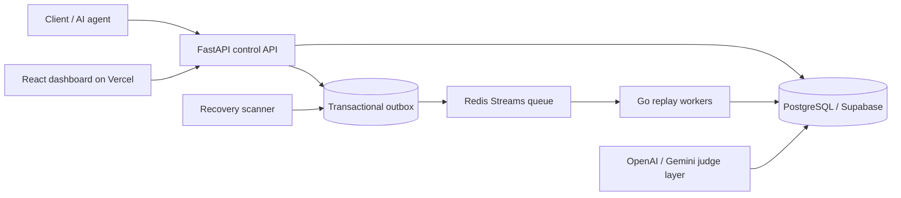

# Converge

Converge is an AI workflow recovery platform built around a strict control plane and evidence-first replay flow.

Target architecture:

- FastAPI control API
- Redis Streams event queue
- Go replay workers
- PostgreSQL claim locking and idempotency state
- Supabase-backed trace and recovery storage
- React dashboard deployed on Vercel
- OpenAI and Gemini judge layer for recovery comparison

## What It Proves

- Events are ingested through FastAPI and written with idempotency protection.
- Outbox rows close the DB-commit / Redis-publish gap.
- Go workers claim stream entries, process them, and ack only after database state is committed.
- Trace, eval, and comparison records are persisted in PostgreSQL, which can be pointed at Supabase in production.
- Recovery evidence is surfaced in the React dashboard and benchmark artifacts.
- External judge providers are optional; deterministic local judges remain the default when keys are absent.

## Architecture



## Local Setup

```bash
docker compose up --build -d
```

Ports:

- API: `http://127.0.0.1:8101`
- API docs: `http://127.0.0.1:8101/docs`
- Health: `http://127.0.0.1:8101/health`
- Frontend: `http://localhost:5171`

## Environment

Backend:

- `DATABASE_URL` points to PostgreSQL or Supabase Postgres
- `REDIS_URL` points to Redis Streams
- `JUDGE_PROVIDER` defaults to `auto`
- `OPENAI_API_KEY` enables the OpenAI judge provider
- `GEMINI_API_KEY` enables the Gemini judge provider
- `OPENAI_JUDGE_MODEL` defaults to `gpt-4o-mini`
- `GEMINI_JUDGE_MODEL` defaults to `gemini-1.5-flash`

Frontend:

- `VITE_API_BASE_URL` should be set on Vercel for production
- leave `VITE_API_BASE_URL` blank for local proxying
- `frontend/vercel.json` rewrites client routes to `index.html`

## Console Routes

- `/` landing page
- `/app` recovery console
- `/app/workers` worker health and claim state
- `/app/streams` Redis backlog and retry pressure
- `/app/replay` DLQ inspection and replay
- `/app/convergence` convergence verification
- `/app/benchmarks` benchmark explorer
- `/app/ai-runs` agent run dashboard
- `/app/ai-runs/:agentRunId` trace viewer
- `/app/ai-runs/:agentRunId/compare` trace comparison
- `/app/ai-evals` eval results
- `/app/architecture` system architecture

## Checked-In Evidence

The repo keeps machine-readable benchmark and chaos artifacts under `benchmarks/` as JSON only.

| Artifact | Status | Submitted | DLQ | Pending after recovery | Recovery time | Throughput |
| --- | --- | ---: | ---: | ---: | ---: | ---: |
| `benchmarks/benchmark_replay_20260702T213707Z.json` | converged | 1000 | 0 | 0 | 9.10s | 109.57 events/sec |
| `benchmarks/chaos_replay_20260701T223433Z.json` | converged | 10 | 0 | 0 | 3.82s | 2.62 events/sec |

The UI reads these JSON artifacts directly. Markdown benchmark/postmortem outputs have been removed from the repository.

## AI Workflow Model

Relevant trace and evaluation fields:

- `agent_run_id`
- `step_id`
- `parent_step_id`
- `tool_name`
- `model_name`
- `provider_name`
- `prompt_hash`
- `system_prompt_hash`
- `input_tokens`
- `output_tokens`
- `retry_reason`
- `trace_status`
- `evaluation_status`
- `replay_confidence`
- `original_output_hash`
- `replayed_output_hash`
- `tool_call_args_hash`
- `tool_call_result_hash`
- `structured_output_valid`
- `failure_category`

## Recovery Lifecycle

1. The API accepts a workflow event or AI step.
2. The event and outbox row are written in PostgreSQL in one transaction.
3. Redis Streams receives the event, or the outbox recovery path republishes it later.
4. Go workers claim the stream message and write claim / attempt state to the database.
5. Pending entries are reclaimed by the worker janitor.
6. DLQ items can be replayed by an operator.
7. Trace comparison and judge-backed evaluation run against original and replayed outputs.
8. Convergence is reported only when database, Redis, and worker state are clean.

## Judge Lifecycle

- Deterministic exact-match, schema, rubric, and fake-LLM judges are available locally.
- OpenAI and Gemini judges are enabled only when their API keys are present.
- The provider endpoint reports the active provider, model, and whether the source is local or external.
- The dashboard shows provider fallback and trace comparison output alongside the replay confidence score.

## Commands

Backend:

```bash
pytest -q api/app/tests/test_ai_ops.py
pytest -q api/app/tests/test_event_ingestion.py api/app/tests/test_replay.py api/app/tests/test_convergence.py
python -m compileall api/app scripts
```

Frontend:

```bash
cd frontend
npm run build
```

Go worker:

```bash
cd worker
go test ./...
```

Compose validation:

```bash
docker compose config
```

Benchmark and chaos:

```bash
python scripts/benchmark_replay.py --events 1000 --workers 2 --mode generic
python scripts/benchmark_replay.py --events 1000 --workers 2 --mode ai-agent --eval-enabled --trace-comparison-enabled
python scripts/chaos_replay.py --events 10 --workers 2 --kill-delay 2
```

Generated benchmark and postmortem commands now emit JSON artifacts only.

## Notes

- Legacy markdown documentation has been removed everywhere except this README.
- The repo still supports local Docker Compose development.
- Supabase is the intended managed Postgres target for production trace and recovery state.
- Vercel is the intended deployment target for the React dashboard.
