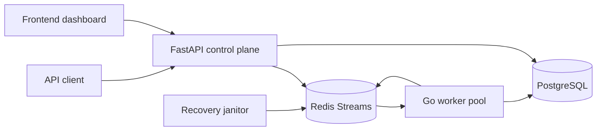

# Converge | Recovery Intelligence & Crash-Safe Replay Platform

Converge is a crash-safe workflow recovery engine with evidence-grounded replay analysis and optional local postmortem generation.

## What it does

- Accepts workflow events through an API
- Buffers them in Redis Streams
- Processes them with a Go worker pool
- Persists idempotent state in PostgreSQL
- Recovers stalled work with a janitor loop
- Exposes the system through an API and dashboard
- Ships a public product landing page plus a dedicated recovery console
- Publishes live backlog, retry, replay-latency, and worker health metrics
- Verifies convergence with explicit replay and recovery reports
- Generates evidence-grounded recovery postmortems from benchmark, chaos, and convergence evidence

## Architecture



## Quick start

```bash
docker compose down -v --remove-orphans
docker compose up --build -d
docker compose ps
./scripts/check_state.sh
make chaos
```

Local host ports:

- API: `http://127.0.0.1:18000`
- PostgreSQL: `127.0.0.1:15432`
- Redis: `127.0.0.1:16379`
- Frontend: `http://localhost:5173`

## Product tour

- `/` public landing page
- `/app` recovery console
- `/app/workers` worker health and heartbeats
- `/app/streams` Redis backlog, pending entries, and retry state
- `/app/replay` replay and DLQ recovery
- `/app/convergence` convergence verification
- `/app/chaos` benchmark and chaos evidence

## Measured evidence

The UI only shows checked-in metrics from real artifacts:

- `benchmarks/benchmark_replay_20260701T225501Z.json` - 1000 events, converged, 0 DLQ, 612.29s recovery time, 1.63 end-to-end events/sec
- `benchmarks/chaos_replay_20260701T230628Z.json` - 100 events, converged, 0 DLQ, 5.29s recovery time, 18.9 end-to-end events/sec

## Correctness Model

- Events are deduplicated with application-scoped idempotency keys.
- Go workers claim PostgreSQL rows before processing Redis stream entries.
- Database writes happen before Redis acknowledgements.
- Pending-entry recovery reclaims stalled messages after worker interruption.
- Retry handling moves poison messages to the DLQ after the configured limit.
- `/api/convergence` reports whether the live stack has drained cleanly.

## Design notes

- The recovery model is at-least-once with idempotent convergence, not exactly-once.
- The worker claims rows in PostgreSQL before acking Redis stream entries.
- The janitor reclaims stale pending entries and pending-entry recovery is built in.
- The repo includes benchmark, chaos, and diagnostic tooling for failure scenarios.
- `GET /health/backend` reports backend-specific status, and `GET /health/backend/stats` exposes stream and replay counters.
- Redis 7.4 emits a `maintnotifications` handshake warning in the worker logs; it is noisy but harmless when `/health` and `/health/ready` are healthy.

## Optional ForgeLog Backend

Converge also ships an experimental WAL-backed storage service called ForgeLog.

- Redis Streams remains the default backend.
- Set `EVENT_BACKEND=forgelog` and `FORGELOG_URL` to route API ingestion to ForgeLog.
- ForgeLog currently provides append/read/health/stats over a durable local log.
- Raft replication is not enabled in the default implementation.
- ForgeLog is not a production-ready database and does not claim exactly-once delivery.
- The Redis Streams worker path remains available and unchanged by default.

Local ForgeLog mode:

```bash
docker compose -f docker-compose.yml -f docker-compose.forgelog.yml up --build -d
python scripts/benchmark_forgelog.py --events 1000
```

## Recovery Postmortem Generator

The postmortem workflow is optional and disabled by default.

- Default mode: `AI_PROVIDER=disabled`
- Fake provider for CI and tests: `AI_PROVIDER=fake`
- Local Ollama mode: `AI_PROVIDER=ollama`
- Local model defaults: `OLLAMA_BASE_URL=http://localhost:11434`, `AI_MODEL=llama3.1:8b`, `AI_FALLBACK_MODEL=qwen2.5-coder:7b`, `AI_TIMEOUT_SECONDS=20`

How to use it:

```bash
python scripts/generate_postmortem.py --artifact benchmarks/benchmark_replay_*.json --workflow-id <workflow_id>
python scripts/evaluate_postmortem.py
```

More details:

- Architecture and guardrails: [docs/RECOVERY_POSTMORTEM.md](docs/RECOVERY_POSTMORTEM.md)
- Product demo route map and talk track: [docs/PRODUCT_DEMO.md](docs/PRODUCT_DEMO.md)
- Existing incident-analysis notes: [docs/AGENTIC_INCIDENT_ANALYSIS.md](docs/AGENTIC_INCIDENT_ANALYSIS.md)
- The generator is evidence-grounded and returns `insufficient_evidence` when the artifacts are too thin.
- It does not replace the recovery engine, the dashboard, or the runbook.

## Portfolio Proof

- Architecture and evaluation: [docs/PORTFOLIO_PROOF.md](docs/PORTFOLIO_PROOF.md)
- Demo and local mode: `docker compose up --build -d`, `./scripts/check_state.sh`, `make chaos`
- Chaos runner: `python scripts/chaos_replay.py --events 1000 --workers 2 --kill-delay 2`
- Benchmark runner: `python scripts/benchmark_replay.py --events 1000 --workers 2` (use `--dry-run` or `--pending` to avoid contacting the API)
- Test commands: backend pytest, worker `go test ./...`, frontend build if needed
- Reliability proof: chaos and runbook docs under `docs/`
