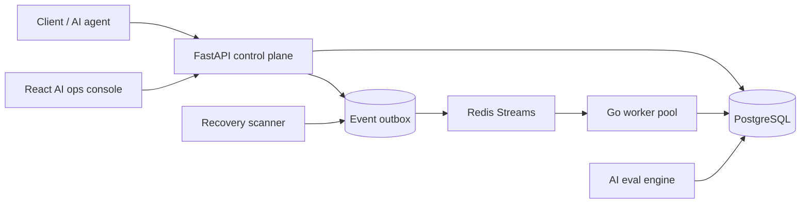

# Converge

Converge is an AI workflow recovery and agent-execution reliability platform.

It is built to prove that long-running AI workflows can be replayed, compared, evaluated, and recovered without hiding the failure modes that matter: DB commit vs Redis publish gaps, duplicate side effects, pending-entry recovery, DLQ replay, and trace drift.

## What it does

- Accepts generic workflow events and AI-agent step traces
- Persists event + outbox rows in PostgreSQL
- Publishes to Redis Streams, with recovery for unpublished rows
- Processes work in a Go worker pool with database-before-ack ordering
- Tracks agent runs, tool calls, replay confidence, failure category, and evaluator verdicts
- Generates deterministic local evals and optional external judge calls when keys exist
- Replays DLQ items and compares original vs replayed trace output
- Exposes recovery, benchmark, chaos, and AI eval evidence in a production-style console

## Architecture



## Local preview

```bash
docker compose up --build -d
```

Ports:

- API: `http://127.0.0.1:8101`
- Frontend: `http://localhost:5171`
- API docs: `http://127.0.0.1:8101/docs`
- Health: `http://127.0.0.1:8101/health`

## Console routes

- `/` landing page
- `/app` AI operations console
- `/app/workers` worker health and heartbeats
- `/app/streams` Redis backlog and retry pressure
- `/app/replay` DLQ inspection and replay
- `/app/convergence` convergence verification
- `/app/benchmarks` benchmark explorer
- `/app/ai-runs` agent run dashboard
- `/app/ai-runs/:agentRunId` prompt and tool trace viewer
- `/app/ai-runs/:agentRunId/compare` trace comparison
- `/app/ai-evals` AI eval results table
- `/app/architecture` system architecture page

## Current checked-in proof

The repository keeps benchmark and chaos JSON/Markdown artifacts under `benchmarks/`.

| Artifact | Status | Submitted | DLQ | Pending after recovery | Recovery time | Throughput |
| --- | --- | ---: | ---: | ---: | ---: | ---: |
| `benchmarks/benchmark_replay_20260702T213707Z.json` | converged | 1000 | 0 | 0 | 9.10s | 109.57 events/sec |
| `benchmarks/chaos_replay_20260701T223433Z.json` | converged | 10 | 0 | 0 | 3.82s | 2.62 events/sec |

These are the checked-in artifacts the UI references today. If you run newer benchmarks, the repo will keep the newer JSON/Markdown outputs alongside the existing ones.

## AI workflow model

Key trace fields carried through the API and database:

- `agent_run_id`
- `step_id`
- `parent_step_id`
- `tool_name`
- `model_name`
- `provider_name`
- `prompt_hash`
- `system_prompt_hash`
- `input_tokens`
- `output_tokens`
- `retry_reason`
- `trace_status`
- `evaluation_status`
- `replay_confidence`
- `original_output_hash`
- `replayed_output_hash`
- `tool_call_args_hash`
- `tool_call_result_hash`
- `structured_output_valid`
- `failure_category`

## Recovery lifecycle

1. Event or AI step is accepted by the API.
2. Event and outbox rows are written in PostgreSQL.
3. The API publishes to Redis Streams.
4. If Redis publish fails after commit, the outbox row stays recoverable.
5. The worker claims the stream message, writes attempt state, then acknowledges the stream.
6. Pending entries are reclaimed by the worker janitor.
7. DLQ rows can be replayed.
8. Convergence is reported only when the database, Redis, and worker state all drain cleanly.

## Eval lifecycle

The local evaluation path is deterministic by default:

- exact-match evaluator
- JSON-schema evaluator
- deterministic rubric evaluator
- deterministic fake LLM judge
- optional OpenAI judge if `OPENAI_API_KEY` exists
- optional Gemini judge if `GEMINI_API_KEY` exists

The AI console surfaces:

- original vs replayed trace comparison
- tool-sequence diff
- output-hash diff
- evaluator verdict diff
- replay confidence score
- failure category summary

## Commands

### Backend

```bash
pytest -q api/app/tests/test_ai_ops.py
pytest -q api/app/tests/test_event_ingestion.py api/app/tests/test_replay.py api/app/tests/test_convergence.py
python -m compileall api/app scripts
```

### Frontend

```bash
cd frontend
npm run build
```

### Go worker

```bash
cd worker
go test ./...
```

### Compose sanity

```bash
docker compose config
```

### Benchmark and chaos

```bash
python scripts/benchmark_replay.py --events 1000 --workers 2 --mode generic
python scripts/benchmark_replay.py --events 1000 --workers 2 --mode ai-agent --eval-enabled --trace-comparison-enabled
python scripts/chaos_replay.py --events 10 --workers 2 --kill-delay 2
```

The benchmark scripts now support:

- `--mode generic|ai-agent`
- `--events`
- `--workers`
- `--concurrency`
- `--payload-size`
- `--redis-stream-batch-size`
- `--db-pool-size`
- `--eval-enabled`
- `--trace-comparison-enabled`

## Resume-safe claims

- The repo has a real AI agent trace model and eval layer.
- The repo has an outbox recovery path for publish failures after DB commit.
- The repo has checked-in benchmark and chaos artifacts.
- The frontend now includes AI run, trace comparison, eval, and architecture screens.
- The current checked-in artifacts are smaller than the aspirational 100K / 3,000+ targets.

## Caveats

- The codebase still contains some legacy package and database identifiers for compatibility.
- The checked-in artifacts do not yet prove a 100K replay or 3,000+ events/sec run.
- Use the generated JSON/Markdown artifacts as the source of truth for interview claims.

