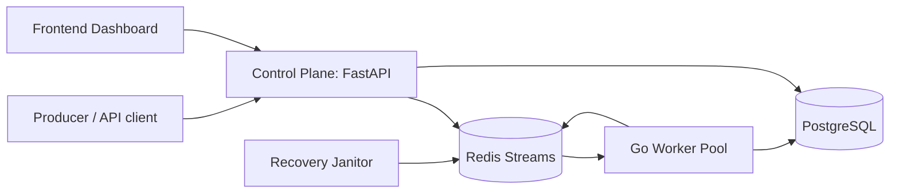
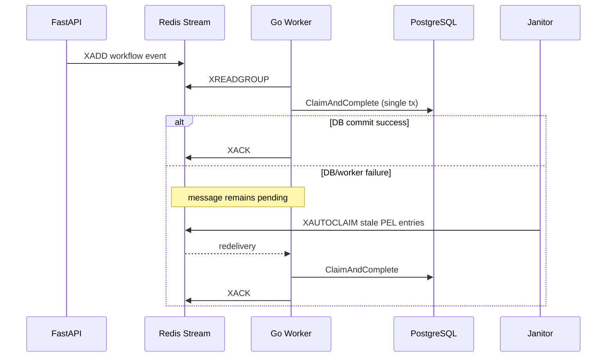

# ReplayForge

Async Workflow Replay and Failure Debugging Platform with a **Python/FastAPI control plane** and **Go data plane**.

## What ReplayForge Does

ReplayForge is built to debug and recover asynchronous workflow failures under crash conditions.

- Ingests events through API
- Pushes them to Redis Streams
- Processes with horizontally scaled Go workers
- Tracks idempotent execution state in Postgres
- Reclaims orphaned pending entries with janitor recovery loops
- Exposes operational visibility via API + frontend dashboard

## Architecture



## Data Plane Reliability Model



## Repository Layout

```text
ReplayForge-Async-Workflow-Replay-Failure-Debugging-Platform/
├── api/                     # FastAPI control plane
├── worker/                  # Go worker data plane
│   ├── cmd/worker/main.go
│   └── pkg/
│       ├── idempotency/
│       ├── recovery/
│       └── streams/
├── frontend/                # React UI
├── tests/                   # Chaos benchmark and validation
├── scripts/                 # Load tests, screenshots, ops scripts
├── migrations/
└── docker-compose.yml
```

## Core Components

### Control Plane (Python/FastAPI)
- Endpoint ingestion, CRUD, metrics, worker visibility
- DB-backed event and workflow views
- Interface for UI and operations workflows

### Data Plane (Go)
- High-throughput stream consumer
- Concurrent worker pool (`runtime.NumCPU() * 2`)
- Crash recovery janitor (`XAUTOCLAIM`)
- Idempotent claim/complete transaction boundary

### Persistence
- **Redis Streams**: transport, consumer group state, PEL ownership
- **PostgreSQL**: durable execution registry and workflow records

## Quickstart

### 1) Start stack

```bash
docker compose down -v --remove-orphans
docker compose up --build -d
```

### 2) Verify services

```bash
docker compose ps
./scripts/check_state.sh
```

### 3) Run chaos benchmark

```bash
python3 tests/benchmark_chaos.py
```

### 4) Run load benchmark

```bash
python3 scripts/load_test.py --events 200 --concurrency 20
```

## Benchmark and Ops Commands

You can also use Makefile shortcuts:

```bash
make down
make up
make chaos
make load
make check
```

## Playwright Screenshot Automation

ReplayForge includes a Playwright script for deterministic UI capture used in docs.

- Script: [scripts/take-screenshots.js](/Users/sushildalavi/Desktop/Github/ReplayForge-Async-Workflow-Replay-Failure-Debugging-Platform/scripts/take-screenshots.js)
- Output: `docs/screenshots/*.png`

Run it:

```bash
# Ensure frontend + API are running on 5173 and 8000
cd scripts
npm install
npx playwright install chromium
node take-screenshots.js
```

## Reliability Diagnostics

### PostgreSQL state

```sql
SELECT status, COUNT(*)
FROM event_idempotency_registry
GROUP BY status
ORDER BY status;
```

### Redis stream/group health

```bash
docker compose exec -T redis redis-cli XINFO GROUPS workflow_events
docker compose exec -T redis redis-cli XPENDING workflow_events replay_forge_workers
docker compose exec -T redis redis-cli XLEN workflow_events
```

## Convergence Targets

For a 100K chaos run:

- Redis group lag: `0`
- Redis pending: `0`
- Postgres `completed`: `100000`
- Postgres `failed`/`terminal`: `0`

## CI Notes

GitHub Actions currently includes:

- Backend tests
- Frontend typecheck + build
- Docker build smoke checks

If CI fails on backend paths, ensure workflows reference `api/` (not legacy `backend/`).

## Known Reality (Interview-Safe Framing)

Use this language:

- Delivery semantics: **at-least-once**
- Consistency model: **idempotent durable convergence**
- Recovery model: **consumer-group PEL reclaim via XAUTOCLAIM**

Avoid claiming exactly-once across Redis + Postgres.

## Docs Index

- [Reliability notes](/Users/sushildalavi/Desktop/Github/ReplayForge-Async-Workflow-Replay-Failure-Debugging-Platform/docs/reliability/README.md)
- [Load test runbook](/Users/sushildalavi/Desktop/Github/ReplayForge-Async-Workflow-Replay-Failure-Debugging-Platform/docs/reliability/load-test-runbook.md)
- [Chaos runbook](/Users/sushildalavi/Desktop/Github/ReplayForge-Async-Workflow-Replay-Failure-Debugging-Platform/docs/reliability/chaos-runbook.md)
- [Redis diagnostics](/Users/sushildalavi/Desktop/Github/ReplayForge-Async-Workflow-Replay-Failure-Debugging-Platform/docs/reliability/redis-diagnostics.md)
- [SQL diagnostics](/Users/sushildalavi/Desktop/Github/ReplayForge-Async-Workflow-Replay-Failure-Debugging-Platform/docs/reliability/sql-diagnostics.md)
- [Known gaps](/Users/sushildalavi/Desktop/Github/ReplayForge-Async-Workflow-Replay-Failure-Debugging-Platform/docs/reliability/known-gaps.md)
