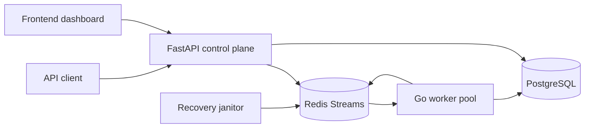

# ReplayForge

ReplayForge is a crash-recovery platform for asynchronous workflows.

## What it does

- Accepts workflow events through an API
- Buffers them in Redis Streams
- Processes them with a Go worker pool
- Persists idempotent state in PostgreSQL
- Recovers stalled work with a janitor loop
- Exposes the system through an API and dashboard

## Architecture



## Quick start

```bash
docker compose down -v --remove-orphans
docker compose up --build -d
docker compose ps
./scripts/check_state.sh
make chaos
```

## Design notes

- The recovery model is at-least-once with idempotent convergence.
- The janitor reclaims stale pending entries.
- The repo includes benchmark and diagnostic tooling for failure scenarios.

## Optional ForgeLog Backend

ReplayForge also ships an experimental WAL-backed storage service called ForgeLog.

- Redis Streams remains the default backend.
- Set `EVENT_BACKEND=forgelog` and `FORGELOG_URL` to route API ingestion to ForgeLog.
- ForgeLog currently provides append/read/health/stats over a durable local log.
- Raft replication is not enabled in the default implementation.
- ForgeLog is not a production-ready database and does not claim exactly-once delivery.
- The Redis Streams worker path remains available and unchanged by default.

Local ForgeLog mode:

```bash
docker compose -f docker-compose.yml -f docker-compose.forgelog.yml up --build -d
python scripts/benchmark_forgelog.py --events 1000
```

## Portfolio Proof

- Architecture and evaluation: [docs/PORTFOLIO_PROOF.md](docs/PORTFOLIO_PROOF.md)
- Demo and local mode: `docker compose up --build -d`, `./scripts/check_state.sh`, `make chaos`
- Benchmark runner: `python scripts/run_chaos_benchmark.py --events 10000 --workers 4` (use `--dry-run` or `--pending` to avoid contacting the API)
- Test commands: backend pytest, worker `go test ./...`, frontend build if needed
- Reliability proof: chaos and runbook docs under `docs/`
